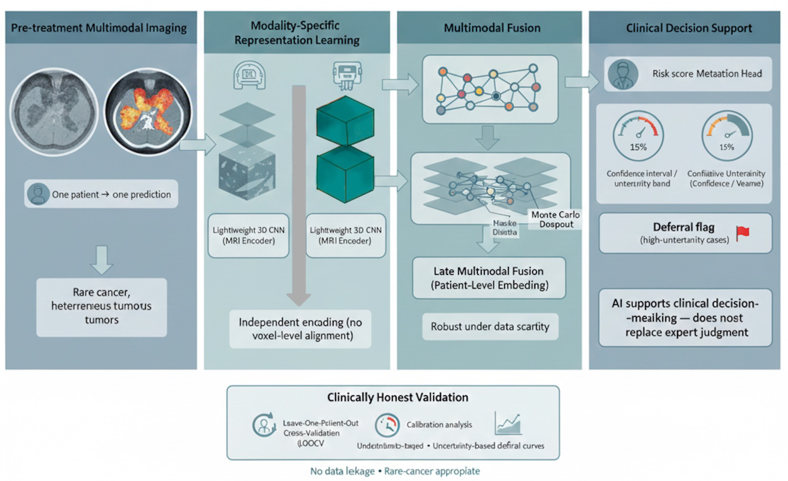

# Uncertainty-Aware Multimodal Imaging for Lung Metastasis Risk Stratification in Extremity Soft-Tissue Sarcoma

[](https://ascopubs.org/doi/abs/10.1200/JCO.2026.44.16_suppl.e23543)

This repository contains the code, models, and (partial) data pipeline for our study on uncertainty-aware multimodal deep learning for predicting lung metastasis risk in extremity soft-tissue sarcoma (STS), using paired pre-treatment MRI and FDG-PET imaging.

This work was published as a **Publication-Only abstract at ASCO (American Society of Clinical Oncology) 2026**, under the Sarcoma track.

> 📌 **If you use this code, methodology, or any part of this work, please cite the publication (see [Citation](#citation) below).**

---

## 📄 Publication

**Title:** Uncertainty-aware multimodal imaging for lung metastasis risk stratification in extremity soft-tissue sarcoma
**Authors:** Manpreet Saini, Agampreet Saini, Erik Cambria
**Affiliations:** Baptist Health UAMS, North Little Rock, AR · School of Computer Science, University of Petroleum and Energy Studies, Dehradun, India · College of Computing and Data Science, Nanyang Technological University, Singapore
**Venue:** ASCO 2026, Abstract e23543 (Sarcoma, Publication Only)
**Link:** https://ascopubs.org/doi/abs/10.1200/JCO.2026.44.16_suppl.e23543

---

## 🧬 Abstract

**Background:** Imaging-based risk prediction in soft-tissue sarcoma has traditionally relied on radiomics and deep learning models optimized purely for discrimination (accuracy, AUC). Most prior studies use small cohorts without any assessment of predictive uncertainty — implicitly assuming every prediction is equally reliable. This is a critical gap for rare cancers like STS, where model confidence is fundamentally constrained by small sample sizes and high biological heterogeneity.

**Methods:** We incorporate uncertainty estimation into a multimodal MRI + FDG-PET deep learning pipeline for lung metastasis risk stratification, aiming to make model output more clinically actionable. Pre-treatment MRI and FDG-PET imaging for extremity STS patients were sourced from **The Cancer Imaging Archive (TCIA)**. Patients were included only if both modalities and confirmed lung metastasis outcomes were available, yielding a cohort of **51 patients (19 metastatic, 32 non-metastatic)**. MRI and PET images were independently encoded via separate CNNs, with latent features fused at the representation stage and optimized using binary cross-entropy loss. **Monte Carlo dropout** was used to estimate predictive uncertainty at inference. Model evaluation used **strict leave-one-patient-out cross-validation** to guarantee complete patient-level separation. Performance was assessed via accuracy, AUC, uncertainty–error correlation, and uncertainty-based deferral. A secondary exploratory analysis on a 10-patient subset examined feasibility under extreme data scarcity.

**Results:** The model achieved a leave-one-out accuracy of **62.8%** and an AUC of **0.28**, reflecting the inherent heterogeneity of lung metastasis prediction in a rare, heterogeneous sarcoma population. Incorrect predictions were strongly associated with higher predictive uncertainty; deferring (excluding) high-uncertainty cases improved accuracy on the remaining patients. The 10-patient exploratory analysis showed a similar pattern, with accuracy reaching **80%** among low-uncertainty cases.

**Conclusions:** While prior sarcoma imaging studies report only point-estimates, this work demonstrates that under severe data constraints, uncertainty-aware multimodal models are a safer basis for clinical decision support. Rather than optimizing purely for accuracy, the approach explicitly flags predictions that should not be trusted — addressing a gap in sarcoma AI literature and aligning with safety-critical practice in oncology.

**Research Sponsor:** None.

---

## 🗂️ Repository Structure

```
.
├── sarcoma_multimodal_ai/         # Core code
│   ├── can-img/                   # Dataset placeholder (imaging data not included — see "Data")
│   ├── src/                       # Model, preprocessing, and training source code
│   ├── run_loocv.py               # Leave-one-patient-out cross-validation runner
│   ├── generate_labels.py         # Builds labels.csv from clinical metadata
│   ├── labels.csv                 # Patient-level metastasis labels
│   ├── INFOclinical_STS.xlsx      # Clinical metadata (TCIA cohort info)
│   ├── environment.yml            # Conda environment spec
│   └── README.md
│
├── results/                        # Zip file with epoch-wise visualized results
│   ├── epoch10-p10/                # Visualizations from the 10-patient exploratory run
│   └── epoch10-p51/                # Visualizations from the full 51-patient leave-one-out run
│
├── data/                          # raw archives
│   ├── *.zip                      # TCIA and GDC data archives (imaging + genomic/clinical, zipped)
│
├──  assets/
│   ├──model-architecture.jpg        
│
└── README.md
```

## 💾 Data

Data used in this study was obtained from **[The Cancer Imaging Archive (TCIA)](https://www.cancerimagingarchive.net/)**, using pre-treatment MRI and FDG-PET scans for extremity soft-tissue sarcoma patients with confirmed lung metastasis outcomes.

Due to size constraints, the **full imaging dataset is not included in this repository**. The `code/data/` directory is a **placeholder** containing:
- `.tar` archives with preprocessing/loading scripts and directory structure references
- `.json` metadata files (patient-level labels, modality manifests, train/eval splits used for leave-one-out CV)

To reproduce results end-to-end, download the corresponding cohort directly from TCIA and place it according to the structure described in `code/data/README.md` (or the manifest JSON).

## ⚙️ Methodology Summary

- **Modalities:** Pre-treatment MRI + FDG-PET (paired per patient)
- **Cohort:** 51 patients (19 metastatic / 32 non-metastatic)
- **Architecture:** Independent CNN encoders per modality → latent feature fusion → binary classifier
- **Loss:** Binary cross-entropy
- **Uncertainty estimation:** Monte Carlo dropout at inference
- **Validation:** Strict leave-one-patient-out cross-validation (no patient overlap between train/test)
- **Metrics:** Accuracy, AUC, uncertainty–error correlation, uncertainty-based deferral analysis
- **Secondary analysis:** 10-patient exploratory subset to test feasibility under extreme data scarcity

## 🖼️ Model Architecture



The pipeline runs left to right: paired pre-treatment MRI and FDG-PET scans are independently encoded by lightweight 3D CNNs (no voxel-level alignment needed), fused at the patient-level embedding stage, and passed through Monte Carlo dropout to produce both a risk score and an uncertainty estimate. High-uncertainty predictions are flagged for deferral rather than forced into a binary call, the model is designed to support clinical judgment, not replace it. Validation follows a leave-one-patient-out (LOOCV) protocol with calibration and uncertainty-based deferral analysis to guard against data leakage in this rare-cancer, small-cohort setting.

## 📊 Key Results

| Setting | Accuracy | AUC | Notes |
|---|---|---|---|
| Full leave-one-out CV (n=51) | 62.8% | 0.28 | Reflects heterogeneity of rare sarcoma population |
| Low-uncertainty subset (after deferral) | Improved over baseline | — | High-uncertainty cases removed |
| 10-patient exploratory subset (low uncertainty) | 80% | — | Feasibility under extreme data scarcity |

The core finding: **incorrect predictions correlate with higher model uncertainty**, and selectively deferring on high-uncertainty cases meaningfully improves reliability on the remaining predictions — supporting uncertainty-aware deployment over point-estimate-only models in rare-cancer imaging AI.

## 📖 Citation

If you use this code, data pipeline, or build on this work, please cite:

```bibtex
@misc{saini2026uncertainty,
  title={Uncertainty-aware multimodal imaging for lung metastasis risk stratification in extremity soft-tissue sarcoma.},
  author={Saini, Manpreet and Saini, Agampreet and Cambria, Erik},
  year={2026},
  publisher={American Society of Clinical Oncology}
}
```

Or in plain text:

> Saini, M., Saini, A. and Cambria, E., 2026. Uncertainty-aware multimodal imaging for lung metastasis risk stratification in extremity soft-tissue sarcoma.

## 🙏 Acknowledgements

Imaging data provided by **The Cancer Imaging Archive (TCIA)**. No external research funding was received for this study (Research Sponsor: None).

## 📬 Contact

For questions about this repository or the underlying research, please open an issue or reach out to the corresponding author(s) listed in the publication.
